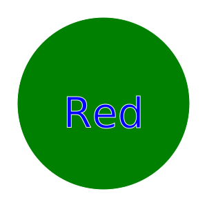

# upgraded-parakeet
Module 10 challenge repository

## Description
The upgraded-parakeet is a Node.js command-line application that allows users to generate custom SVG logos for their projects. Users can specify the text, text color, shape, and shape color to create unique logos without the need for a graphic designer.




## Table of Contents
- [Installation](#installation)
- [Usage](#usage)
- [Features](#features)
- [Walkthrough Video](#walkthrough-video)
- [Tests](#tests)
- [Contributing](#contributing)
- [License](#license)

## Installation
To install the upgraded-parakeet, follow these steps:

1. Clone the repository to your local machine:
   ```bash
   git clone https://github.com/your-username/upgraded-parakeet.git
2. Change to the project directory:
    ```bash  
    cd upgraded-parakeet  
3. Install the required dependencies using npm:  
    ```bash
    npm install   
    
## Usage
To use the upgraded-parakeet, run the following command in your terminal:  
   
    node index.js  
Follow the prompts to enter text, text color, shape, and shape color. The application will generate an SVG logo file named logo.svg.  

## Features
Accepts user input for text, text color, shape, and shape color.  
Supports custom text (up to three characters) and a wide range of colors.  
Provides a choice of shapes: circle, triangle, and square.  
Generates SVG logos that can be easily viewed in a web browser.  

## Tests
The application includes unit tests for the Triangle, Circle, and Square classes. You can run the tests using Jest. To run the tests, use the following command:  
npm test

## Contributing
If you'd like to contribute to this project, please follow these guidelines:  
Fork the repository.
Create a new branch for your feature or fix: 

    
    git checkout -b feature-name
Make your changes and commit them:  


    git commit -m 'Add new feature'  

Push to your created branch:  

    git push origin feature-name.  
Create a pull request with a detailed description of your changes.  

## License
This project is licensed under the MIT license.  
License Link  
https://opensource.org/licenses/MIT   
[]  

## Walkthrough Video
You can watch a walkthrough video demonstrating how to use the application and showcasing it's functionality by clicking the link below. 
### Video example 1: original
https://watch.screencastify.com/v/F8VOUnrzpKb4aR9cpN25
### Video example 2: gradient


